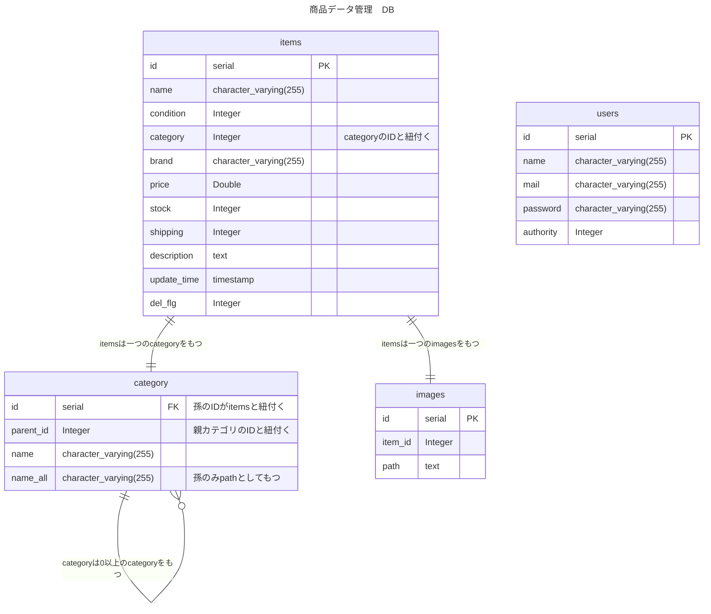

# 商品データ管理システム演習

## 機能実装についての補足

### 1. ログイン画面

- サーバー側だけでなく、画面での入力チェックも追加しています。

（mail, password の入力チェックと、mail は形式が不正であればエラーに）

### 2. 商品一覧画面

- カテゴリーの選択で入力はできません。（カテゴリ追加画面のように実装はできますが、JavaScript が動かなくなるので、選択のみにしてあります。検討はします。）
- 検索条件のクリアができなかったので、クリアボタンを追加しました。
- 商品一覧データのダウンロードボタンを商品追加ボタンの左に作成しました。
  （検索条件があれば、その条件での商品一覧データのダウンロードになります）
- ソートをする前は id の昇順。そこからソートボタンを押すことでそのフィールドの昇順、降順になるようにしています。
  （なんのソートになっているのかの表示は実装していません。必要であれば作成します。）
- 検索、ページジャンプ機能のボタンは選択がなければ押せないようにしています。

### 3. 商品詳細画面

- image 表示欄を追加しました。
  （image の登録がされていないものは、default で no-image が表示してあります。）

### 4. 商品編集画面

- default で元情報が表示されていることを明記しました。
- image の登録ボタンと、元画像、更新画像のプレビュー欄を追加しました。
- 元情報に戻すボタンがなかったので、クリアボタンを追加しました。
- 変更がなければ submit ボタンは押せないようにしました。
- delete だけでなく、submit ボタンを押した際にもポップアップでの確認を追加しました。
- 入力についての注意事項を前もって明記しました。
- 変更箇所は欄の色が変わるようにしました。

### 5. 商品追加画面

- category のみ、前回入力値が表示されません。
  （対応します）
- image の登録ボタンと、画像のプレビュー欄を追加しました。
- 入力についての注意事項を前もって明記しました。

### 6. 管理者画面

- サーバー側だけでなく、画面での入力チェックも追加しています。
- 前もって全項目入力必須のことと、入力条件を明記しました。

### 7,8. 共通部品

- カテゴリ一覧へのリンクを追加しました。
- ログアウトボタンが実装の関係でハンバーガーにした時に少しずれます。
  （対応します）
- （関係ないかもしれませんが）nav-bar はテンプレート化して、nav-bar.HTML として保存してあります。

### 9. 画面一覧、遷移、メッセージ一覧

- 実装の関係で、エラーメッセージを追加しています。
- 管理者登録、商品の追加,編集,削除、カテゴリの追加,編集,削除成功時は、一度専用の HTML に飛ぶようにしてあります。
  （仕様書と異なるので、必要なければ削除します。）

## ER 図

