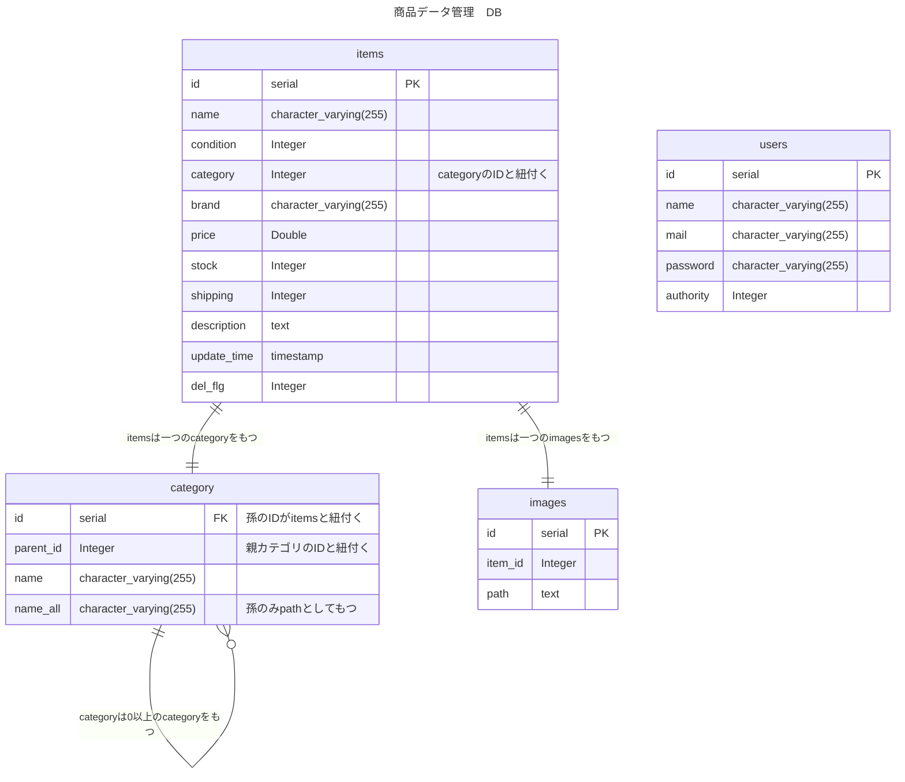

# 商品データ管理システム演習

## ER 図

```mermaid
---
title: 商品データ管理　DB
---
    erDiagram

        items ||--|| category : "itemsは一つのcategoryをもつ"
        items ||--|| images : "itemsは一つのimagesをもつ"
        category ||--o{ category : "categoryは0以上のcategoryをもつ"

      category {
        id serial FK "孫のIDがitemsと紐付く"
        parent_id Integer "親カテゴリのIDと紐付く"
        name character_varying(255)
        name_all character_varying(255) "孫のみpathとしてもつ"
      }

      items {
        id serial PK
        name character_varying(255)
        condition Integer
        category Integer "categoryのIDと紐付く"
        brand character_varying(255)
        price Double
        stock Integer
        shipping Integer
        description text
        update_time timestamp
        del_flg Integer
      }

      users{
        id serial PK
        name character_varying(255)
        mail character_varying(255)
        password character_varying(255)
        authority Integer
      }

      images{
        id serial PK
        item_id Integer
        path text
      }
```

## クラス図

```mermaid
---
title: 商品データ管理システム
---
    classDiagram
        class CategoryController{
        +CategoryController: toCategoryList(int parentPage, int childPage, int grandPage, Model model) String
        +CategoryController: toSearchCategory(String searchCategory, int parentPage, int childPage, int grandPage, Model model) String
        +CategoryController: toSearchParentPage(int parentPage, Model model) String
        +CategoryController: toSearchChildPage(int childPage, Model model) String
        +CategoryController: toSearchGrandPage(int grandPage, Model model) String
        +CategoryController: categoryDetail(int id, Model model) String
        +CategoryController: toAddCategory(CategoryForm categoryform, Model model) String
        +CategoryController: addCategory(@Validated CategoryForm categoryform, BindingResult rs, Model model) String
        +CategoryController: toEditCategory(int id, Model model) String
        +CategoryController: editCategory(CategoryForm form, Model model) String
        +CategoryController: deleteCategory(int id, int parentId, String nameAll, Model model) String
        -CategoryController: totalPageCount(int totalCategoryCount) int
        }

        class ItemController{
        +ItemController: toItemList(int page, String sort, String order, Model model) String
        +ItemController: toSearch(@Validated SearchForm form, BindingResult rs, int page, Model model) String
        +ItemController: toSort(String sort, String order, Model model) String
        +ItemController: toSearchPage(int page, Model model) String
        +ItemController: toCategoryFilter(String name, int parentId, String nameAll, Model model) String
        +ItemController: toBrandFilter(String brand, Model model) String
        +ItemController: toAddItem(ItemForm itemForm, CategoryForm categoryForm, Model model) String
        +ItemController: addItem(@Validated ItemForm itemForm, BindingResult itemRs, @Validated CategoryForm, BindingResult categoryRs, Model model) String
        +ItemController: detail(int id, Model model) String
        +ItemController: toEditItem(int id, ItemForm itemForm, CategoryForm categoryForm, Model model) String
        +ItemController: editItem(@Validated ItemForm itemForm, BindingResult rs, CategoryForm categoryForm, Model model) String
        +ItemController: deleteItem(int id, Timestamp updateTime, Model model) String
        +ItemController: downloadItemData(HTTPServletResponse response)
        -ItemController: totalPageCount(int totalItemCount) int
        }

        class LoginController{
        +LoginController: login(String error, Model model) String
        }

        class UserController{
        +UserController: toRegister(UserForm form, Model model) String
        +UserController: registerUser(@Validated UserForm form, BindingResult rs, Model model) String
        }

        class CustomDecimalValidator{
        +CustomDecimalValidator: initialize(DecimalRange constraintAnnotation)
        +CustomDecimalValidator: isValid(Double value, ConstraintValidatorContext context) boolean
        }

        class CustomLoginSuccessHandler{
        +CustomLoginSuccessHandler: onAuthenticationSuccess(HttpServletRequest request, HttpServletResponse response, Authentication authentication)
        }

        class CustomUserDetailsService{
        +CustomUserDetailsService: loadUserByUsername(String mail) UserDetails
        }

        class CustomWebMvcConfigurer{
        +CustomWebMvcConfigurer: addResourceHandlers(@NonNull ResourceHandlerRegistry registry)
        }

        class DecimalRange
        <<interface>> DecimalRange
        DecimalRange: String message()
        DecimalRange: Class<?>[] groups()
        DecimalRange: Class<? extends Payload>[] payload()
        DecimalRange: double min()
        DecimalRange: double max()


        class Category{
        -Integer id
        -Integer parentId
        -String name
        -String nameAll

        +Category: getId() int
        +Category: setId(Integer id)
        +Category: getParentId() int
        +Category: setParentId(Integer parentId)
        +Category: getName() String
        +Category: setName(String name)
        +Category: getNameAll() String
        +Category: setNameAll(String nameAll)
        +Category: toString() String
        }

        class Image{
        -Integer id
        -Integer itemId
        -String path

        +Image: getId() int
        +Image: setId(Integer id)
        +Image: getItemId() int
        +Image: setItemId(Integer itemId)
        +Image: getPath() String
        +Image: setPath(String path)
        +Image: toString() String
        }

        class Item{
        -Integer id
        -String name
        -Integer Condition
        -List~Category~ category
        -String brand
        -Double price
        -Integer stock
        -Integer shipping
        -String description
        -Date updateTime
        -Integer delFlg

        +Item: getId() int
        +Item: setId(Integer id)
        +Item: getName() String
        +Item: setName(String name)
        +Item: getCondition() int
        +Item: setCondition(Integer condition)
        +Item: getCategory() List~Category~
        +Item: setCategory(List~Category~ category)
        +Item: getBrand() String
        +Item: setBrand(String brand)
        +Item: getPrice() Double
        +Item: setPrice(Double price)
        +Item: getStock() int
        +Item: setStock(Integer stock)
        +Item: getShipping() int
        +Item: setShipping(Integer shipping)
        +Item: getDescription() String
        +Item: setDescription(String description)
        +Item: getUpdateTime() Date
        +Item: setUpdateTime(Date updateTime)
        +Item: getDelFlg() int
        +Item: setDelFlg(Integer delFlg)
        +Item: toString() String
        }

        class User{
        -Integer id
        -String name
        -String mail
        -String password
        -Integer authority

        +User: getId() int
        +User: setId(Integer id)
        +User: getName() String
        +User: setName(String name)
        +User: getMail() String
        +User: setMail(String mail)
        +User: getPassword() String
        +User: setPassword(String password)
        +User: getAuthority() int
        +User: setAuthority(Integer authority)
        +User: toString() String
        }

        class CategoryForm{
        -Integer id
        -String name
        -Integer parentId
        -String parentCategory
        -String childCategory
        -String grandCategory
        -String nameAll

        +CategoryForm: getId() int
        +CategoryForm: setId(Integer id)
        +CategoryForm: getName() String
        +CategoryForm: setName(String name)
        +CategoryForm: getParentId() int
        +CategoryForm: setParentId(Integer parentId)
        +CategoryForm: getParentCategory() String
        +CategoryForm: setParentCategory(String parentCategory)
        +CategoryForm: getChildCategory() String
        +CategoryForm: setChildCategory(String childCategory)
        +CategoryForm: getGrandCategory() String
        +CategoryForm: setGrandCategory(String grandCategory)
        +CategoryForm: getNameAll() String
        +CategoryForm: setNameAll(String nameAll)
        +CategoryForm: toString() String
        }

        class ItemForm{
        -Integer id
        -String name
        -Integer Condition
        -Integer category
        -String brand
        -Double price
        -Integer stock
        -Integer shipping
        -String description
        -Date updateTime
        -Integer delFlg
        -MultipartFile image

        +ItemForm: getId() int
        +ItemForm: setId(Integer id)
        +ItemForm: getName() String
        +ItemForm: setName(String name)
        +ItemForm: getCondition() int
        +ItemForm: setCondition(Integer condition)
        +ItemForm: getCategory() Integer
        +ItemForm: setCategory(Integer category)
        +ItemForm: getBrand() String
        +ItemForm: setBrand(String brand)
        +ItemForm: getPrice() Double
        +ItemForm: setPrice(Double price)
        +ItemForm: getStock() int
        +ItemForm: setStock(Integer stock)
        +ItemForm: getShipping() int
        +ItemForm: setShipping(Integer shipping)
        +ItemForm: getDescription() String
        +ItemForm: setDescription(String description)
        +ItemForm: getUpdateTime() Date
        +ItemForm: setUpdateTime(Date updateTime)
        +ItemForm: getDelFlg() int
        +ItemForm: setDelFlg(Integer delFlg)
        +ItemForm: getImage() MultipartFile
        +ItemForm: setImage(MultipartFile image)
        +ItemForm: toString() String
        }

        class UserForm{
        -String name
        -String mail
        -String password
        -String passwordCheck

        +UserForm: getName() String
        +UserForm: setName(String name)
        +UserForm: getMail() String
        +UserForm: setMail(String mail)
        +UserForm: getPassword() String
        +UserForm: setPassword(String password)
        +UserForm: getPasswordCheck() int
        +UserForm: setPasswordCheck(Integer passwordCheck)
        +UserForm: toString() String
        }

        class SearchForm{
        -String name
        -String brand
        -String parentCategory
        -String childCategory
        -String grandCategory
        -String sort
        -String order

        +SearchForm: getName() String
        +SearchForm: setName(String name)
        +SearchForm: getBrand() String
        +SearchForm: setBrand(String brand)
        +SearchForm: getParentCategory() String
        +SearchForm: setParentCategory(String parentCategory)
        +SearchForm: getChildCategory() String
        +SearchForm: setChildCategory(String childCategory)
        +SearchForm: getGrandCategory() String
        +SearchForm: setGrandCategory(String grandCategory)
        +SearchForm: getSort() String
        +SearchForm: setSort(String sort)
        +SearchForm: getOrder() String
        +SearchForm: setOrder(String order)
        +SearchForm: toString() String
        }

        class CategoryRepository{
        -RowMapper~Category~ CATEGORY_ROWMAPPER
        -String FIND_ALL_SQL
        -String FIND_NAME_BY_ID_SQL
        -String CHECK_CATEGORY_BY_NAMEALL_SQL
        -String UPDATE_NAMEALL_SQL
        -String INSERT_SQL
        -String FIND_PARENT_CATEGORY_SQL
        -String FIND_CHILD_CATEGORY_SQL
        -String FIND_GRAND_CATEGORY_SQL
        -String PARENT_CATEGORY_SIZE_SQL
        -String CHILD_CATEGORY_SIZE_SQL
        -String GRAND_CATEGORY_SIZE_SQL
        -String SEARCH_PARENT_BY_NAME_SQL
        -String SEARCH_CHILD_CATEGORY_BY_NAME_SQL
        -String SEARCH_GRAND_CATEGORY_BY_NAME_SQL
        -String SEARCH_PARENT_CATEGORY_SIZE_BY_NAME_SQL
        -String SEARCH_CHILD_CATEGORY_SIZE_BY_NAME_SQL
        -String SEARCH_GRAND_CATEGORY_SIZE_BY_NAME_SQL
        -String FIND_BY_ID_SQL
        -String FIND_CHILD_CATEGORY_BY_PARENT_ID_SQL
        -String CHILD_CATEGORY_SIZE_BY_PARENT_ID_SQL
        -String FIND_PARENT_CATEGORY_BY_ID_SQL
        -String DELETE_SQL

        +CategoryRepository findAllCategory()List~Category~
        +CategoryRepository findNameById(int id) String
        +CategoryRepository findById(int id) Category
        +CategoryRepository checkCategory(StringnameAll) Integer
        +CategoryRepository checkCategoryName(Stringname, int parentCondition) Integer
        +CategoryRepository editCategoryName(int id,String name, int parentCondition)
        +CategoryRepository editCategoryNameAll(intid, String name, String originalName, StringoriginalNameLike)
        +CategoryRepository insertCategory(StringnameAll)
        +CategoryRepository findAllParentCategory(intpage) List~Category~
        +CategoryRepository findAllChildCategory(intpage) List~Category~
        +CategoryRepository findAllGrandCategory(intpage) List~Category~
        +CategoryRepository parentListSize() Integer
        +CategoryRepository childListSize() Integer
        +CategoryRepository grandListSize() Integer
        +CategoryRepository searchParentCategor(String nameLike, Integer page) List~Category~
        +CategoryRepository searchChildCategory(StringnameLike, int page) List~Category~
        +CategoryRepository searchGrandCategory(StringnameLike, int page) List~Category~
        +CategoryRepository searchParentTotal(StringnameLike) Integer
        +CategoryRepository searchParentTotal(StringnameLike) Integer
        +CategoryRepository searchChildTotal(StringnameLike) Integer
        +CategoryRepository searchGrandTotal(StringnameLike) Integer
        +CategoryRepository childCategorySize(int id)Integer
        +CategoryRepository findChildCategory(int id)List~Category~
        +CategoryRepository findParentCategory(intparentId) Category
        +CategoryRepository delete(int id)
        }

        class ImageRepository{
        -String INSERT_SQL
        -String FIND_PATH_BY_ITEM_ID_SQL
        -String UPDATE_PATH_SQL

        +ImageRepository: insert(int itemId, String path)
        +ImageRepository: findPathByItemId(int itemId) String
        +ImageRepository: updatePath(int itemId, String path)
        }

        class ItemRepository{
        -RowMapper~Item~ ITEM_ROWMAPPER
        -String FIND_ALL_SQL
        -String ITEMLIST_SIZE_SQL
        -String SEARCH_ALL_ITEMS_SQL
        -String SEARCH_ITEM_LIST_SIZE_SQL
        -String FIND_BY_ID_SQL
        -String INSERT_SQL
        -String UPDATE_SQL
        -String GET_UPDATETIME_SQL
        -String CHECK_DELETE_SQL
        -String CHANGE_DELETE_SQL
        -String COUNT_ITEM_BY_CATEGORY_SQL

        +ItemRepository findAllItems() List~Item~
        +ItemRepository findItems(String sort, String order, int page) List~Item~
        +ItemRepository itemListSize() Integer
        +ItemRepository searchAllItems(String name, String brand, String nameAll) List~Item~
        +ItemRepository searchItems(String name, String brand, String nameAll, String sort, String order, int page) List~Item~
        +ItemRepository searchItemsSize(String name, String brand, String nameAll) Integer
        +ItemRepository findById(int id) Item
        +ItemRepository insertItem(Item item, String nameAll) Integer
        +ItemRepository updateItem(Item item, String nameAll)
        +ItemRepository checkDelete(int id, Timestamp updateTime) Integer
        +ItemRepository changeDeleteStatus(int id)
        +ItemRepository countItemByCategory(int category) Integer
        }

        class userRepository{
        -RowMapper~User~ USER_ROWMAPPER
        -String INSERT_SQL
        -String FIND_BY_MAIL_SQL

        +UserRepository insertUser(String name, String mail, String password)
        +UserRepository findUserByMail(String mail) User
        }

        class SecurityConfig{
        +SecurityConfig: passwordEncoder() PasswordEncoder
        +SecurityConfig: authenticationSuccessHandler() AuthenticationSuccessHandler
        +SecurityConfig: securityFilterChain(HttpSecurity http) SecurityFilterChain
        }

        class SHA256PasswordEncoder{
        +SHA256PasswordEncoder: encode(CharSequence rawPassword) String
        +SHA256PasswordEncoder: matches(CharSequence rawPassword, String encodedPassword) boolean
        }


```
